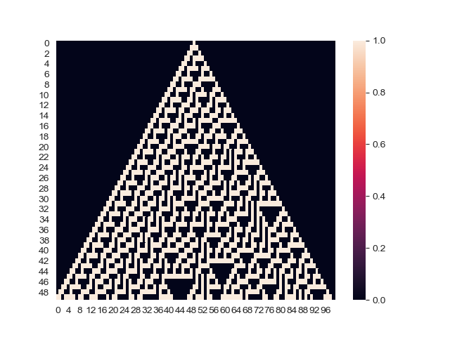

# Simulation Exercises 
1) Cellular Automata

2) Juego de la Vida
3) Schelling
4) Grafos
5) Random Walk
6) Random Walk in Barabassi
7) Schelling Redes
8) Epidemia
9) Redes Dinamicas
10)Coupled-Map-Lattices
